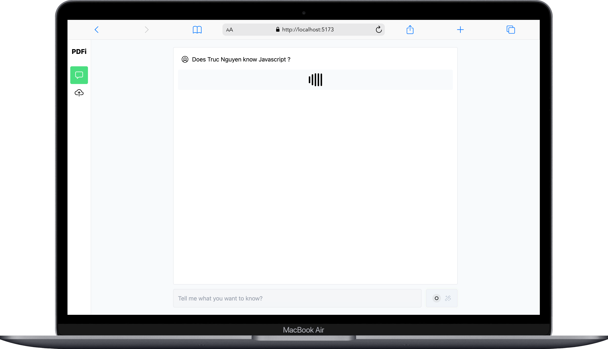
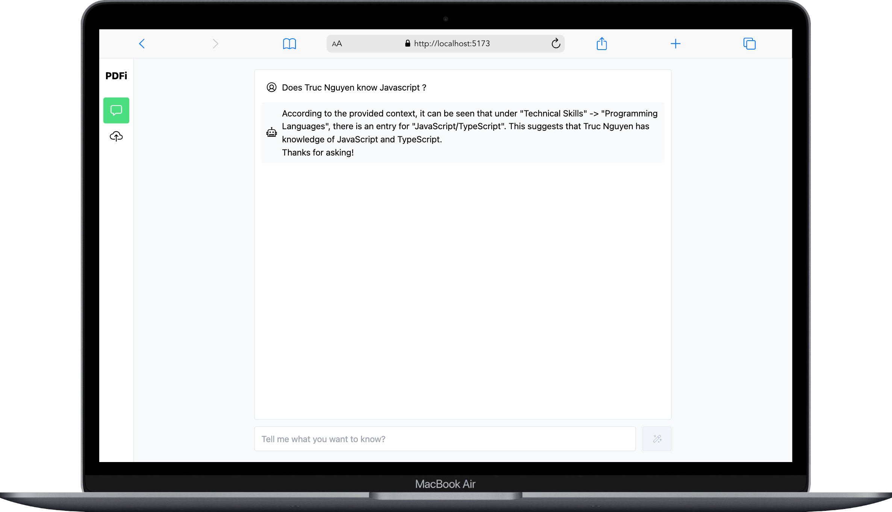

# 🦙🦙🦙 PDF Insight

Experiment project with LLM RAG using llama3 and langchain

## Roadmap
- [x] Load PDFs from directory
- [x] Q&A with context from loaded PDFs
- [ ] Stream text to UI
- [ ] Format chat response

## Screenshots

<table>
    <tr>
        <td>
          
        </td>
        <td>
         
        </td>
    </tr>
</table>

## Reference
- https://ollama.com/library/llama3
- https://python.langchain.com/docs/use_cases/question_answering
